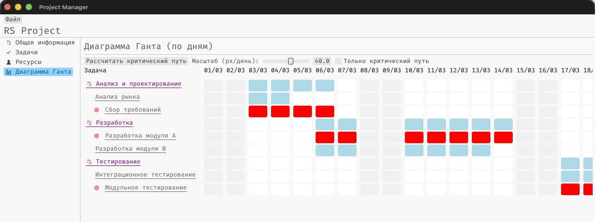
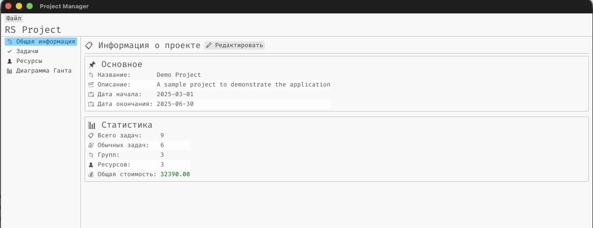
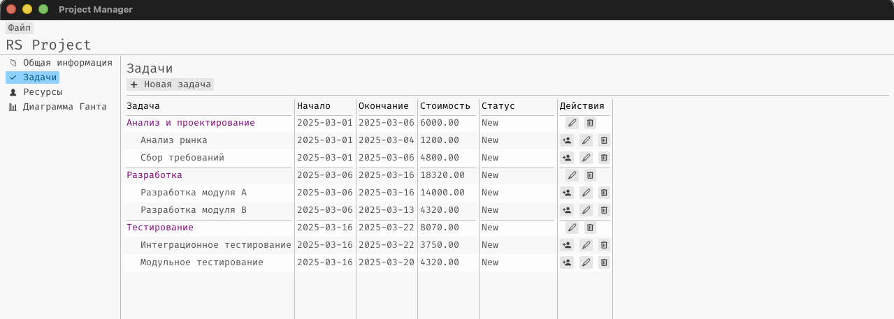
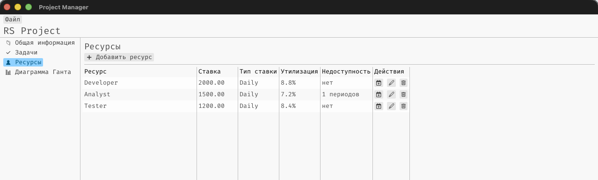

# RS Project

**Открытый аналог MS Project на Rust** — кроссплатформенное настольное приложение для
планирования проектов: задачи с иерархией, ресурсы, зависимости, критический путь
и диаграмма Ганта.

[](LICENSE)
[](https://github.com/DarkwingDuck48/rsproject/releases/latest)
[](https://github.com/DarkwingDuck48/rsproject/actions/workflows/ci.yml)




## Содержание

- [Что это](#что-это)
- [Что это не](#что-это-не)
- [Возможности](#возможности)
- [Скриншоты](#скриншоты)
- [Быстрый старт](#быстрый-старт)
- [Примеры проектов](#примеры-проектов)
- [Технологии](#технологии)
- [Документация](#документация)
- [Участие в разработке](#участие-в-разработке)
- [Лицензия](#лицензия)

## Что это

RS Project закрывает базовый цикл планирования проекта:

- **Задачи** — иерархия любой глубины: обычные и сводные (групповые) задачи, даты,
  длительность, статус, стоимость.
- **Зависимости** — связи между задачами с типом (блокирующая/неблокирующая) и лагом в днях.
- **Ресурсы** — пул ресурсов со ставками, назначение на задачи с долей занятости,
  периоды недоступности (отпуска, больничные и т.д.).
- **Критический путь** — расчёт и подсветка на диаграмме Ганта.
- **Диаграмма Ганта** — SVG-диаграмма по дням: полосы задач, стрелки зависимостей, тултипы.

Принципы, на которых построен проект:

- **Локально, без облака.** Приложение работает офлайн, проект — обычный JSON-файл на диске.
  Ни аккаунтов, ни серверов, ни телеметрии.
- **Кроссплатформенность.** Windows, macOS и Linux из одной кодовой базы.
- **Открытый код.** Лицензия Apache-2.0, вся разработка ведётся на GitHub.
- **Логика отделена от интерфейса.** Бизнес-логика лежит в самостоятельном крейте `logic`
  и не зависит от UI — её можно использовать в других приложениях.

## Что это не

Чтобы не было завышенных ожиданий:

| Это не…                             | Пояснение                                                                                                                                                   |
| ----------------------------------- | ----------------------------------------------------------------------------------------------------------------------------------------------------------- |
| **Полная замена MS Project**        | Нет базового плана (baseline), процента выполнения, выравнивания ресурсов, отмены/повтора действий (undo/redo)                                              |
| **Автоматическое перепланирование** | Даты задач вводятся вручную и не пересчитываются: критический путь считается от даты старта проекта по длительностям и зависимостям, а не по введёным датам |
| **Средство обмена с MS Project**    | Импорт и экспорт MSPDI (`.xml`/`.mpp`) пока не реализованы                                                                                                  |
| **Мультипроектный инструмент**      | Работа идёт с одним проектом за раз; открытие нескольких проектов и их объединение — в планах                                                               |
| **Веб-приложение или SaaS**         | Серверной части нет: ни совместной работы, ни синхронизации между устройствами                                                                              |
| **Тайм-трекер**                     | Фактически затраченное время не учитывается — планирование ведётся на уровне дат                                                                            |

## Возможности

### Проект

- Создание, редактирование и закрытие проекта
- Хранение в JSON; открытие и сохранение через системные диалоги,
  которые запоминают последнюю использованную папку
- Даты начала и окончания, длительность проекта
- Календарь проекта (рабочие дни, праздники, рабочие часы в день) — используется
  при проверке доступности ресурсов

### Задачи

- Дерево задач: обычные и сводные (групповые) задачи любой вложенности
- Дата начала, дата окончания, длительность, статус (Новая, Ожидание, В работе,
  Завершена, Отклонена, Закрыта), стоимость
- Зависимости от других задач: блокирующая/неблокирующая, с лагом в днях
- Назначение ресурсов с долей занятости и окном времени; назначение можно снять

### Ресурсы

- Пул ресурсов: название, ставка и мера ставки (в час / в день / в месяц)
- Периоды недоступности с типом исключения: отпуск, болезнь, личный день, сверхурочные

### Проверки при назначении ресурса

Назначение не пройдёт, если оно нарушает ограничения — вместо некорректных данных
пользователь получит сообщение об ошибке:

- ресурс недоступен в выбранном окне (нерабочие дни, отпуск, больничный);
- ресурс перегружен: сумма долей занятости по пересекающимся назначениям превысила 100%.

### Диаграмма Ганта и критический путь

- SVG-диаграмма по дням с осью месяцев и чисел, подсветкой выходных и сеткой недель
- Три типа полос: обычная задача, сводная задача, критический путь (с легендой)
- Стрелки зависимостей (с учётом лага) и тултипы с названием, датами и длительностью
- Кнопка «Рассчитать критический путь»: путь — это самая длинная цепочка работ от даты
  старта проекта; результат сохраняется в состоянии приложения и переживает переключение вкладок
- Горизонтальная и вертикальная прокрутка для длинных проектов

### Интерфейс

- Четыре раздела: «Проект», «Задачи», «Ресурсы», «Диаграмма Ганта»;
  боковая панель со списком элементов и статус-бар со сводкой по проекту
- Статус-бар: количество задач и ресурсов, длительность критического пути,
  время последнего сохранения
- Светлая и тёмная тема с сохранением выбора
- Горячие клавиши: `Ctrl/Cmd+N` — новый проект, `Ctrl/Cmd+O` — открыть,
  `Ctrl/Cmd+S` — сохранить, `Delete` — удалить выбранную задачу или ресурс
- Выделение синхронизировано между боковой панелью и таблицами
- Адаптивная раскладка: таблицы получают горизонтальную прокрутку вместо сжатия
  колонок, минимальный размер окна — 640×480

## Скриншоты

### Информация о проекте



### Задачи с иерархией



### Ресурсы



### Диаграмма Ганта и критический путь


## Быстрый старт

### Вариант 1. Готовая сборка

Готовые файлы для Windows, macOS и Linux — на
[странице релизов](https://github.com/DarkwingDuck48/rsproject/releases/latest):

| Платформа | Файл                    |
| --------- | ----------------------- |
| Windows   | `rsproject-windows.exe` |
| macOS     | `rsproject-macos`       |
| Linux     | `rsproject-linux`       |

Установщика нет: это портативные исполняемые файлы — скачайте и запустите.
Сборки не подписаны, поэтому операционная система может предупредить о запуске
файла из интернета.

**macOS.** Разрешите выполнение файла и снимите карантин Apple:

```bash
chmod +x /путь/к/скачанному/rsproject
xattr -d com.apple.quarantine /путь/к/rsproject
```

**Windows.** Может появиться предупреждение SmartScreen — «Подробнее» →
«Выполнить в любом случае».

**Linux.** Для запуска требуется `webkit2gtk` (в большинстве дистрибутивов уже
установлен; для сборки нужны заголовки `libwebkit2gtk-4.1-dev`).

### Вариант 2. Сборка из исходников

Требования:

- [Rust](https://www.rust-lang.org/tools/install) 1.85+ (проект использует edition 2024)
- [Node.js](https://nodejs.org/) 20.19+ или 22.12+ — для сборки фронтенда

Режим разработки (Vite dev-сервер и горячая перезагрузка фронтенда):

```bash
git clone https://github.com/DarkwingDuck48/rsproject.git
cd rsproject/app
npm ci
npm run tauri dev
```

Production-сборка (бинарник и бандлы появятся в `target/release/`):

```bash
cd app
npm run tauri build
```

<details>
<summary>Ручная сборка — то же, что делает CI</summary>

Фронтенд нужно собрать **до** компиляции Rust: Tauri встраивает содержимое
`app/dist` в бинарник. Фича `custom-protocol` включает production-режим Tauri —
без неё даже `--release`-бинарник будет искать dev-сервер на `http://localhost:1420`.

```bash
cd app
npm ci
npm run build
cd ..
cargo build --release -p app --features custom-protocol
./target/release/rsproject
```

</details>

## Примеры проектов

Готовые проекты для знакомства с приложением — откройте их через
**«Файл → Открыть проект»**:

| Файл                                                              | Содержимое                                                                                          |
| ----------------------------------------------------------------- | --------------------------------------------------------------------------------------------------- |
| [`demo_project.json`](examples/demo_project.json)                 | Небольшой проект: 9 задач, 3 ресурса, иерархия, зависимости, назначения и отпуск ресурса            |
| [`big_project.json`](examples/big_project.json)                   | Крупный проект на 2 года: 34 задачи, 6 ресурсов, длинные цепочки зависимостей по критическому пути  |
| [`apartment_renovation.json`](examples/apartment_renovation.json) | Ремонт квартиры: 26 задач в 5 фазах, бригада из 6 человек, лаг на сушку стяжки, отпуск и больничный |

Файлы лежат в папке [`examples/`](examples) и генерируются инструментами из крейта
[`tools`](tools) — они собирают проект через публичный API `logic` и печатают JSON в stdout:

```bash
cargo run -p tools --bin gen_demo_project > examples/demo_project.json
cargo run -p tools --bin gen_big_project > examples/big_project.json
cargo run -p tools --bin gen_apartment_renovation > examples/apartment_renovation.json
```

Генераторы создают случайные идентификаторы (UUID v4), поэтому повторный запуск даёт файл
с тем же проектом, но другими ID — обновляйте примеры вместе с изменением модели данных.

## Технологии

Cargo workspace из трёх крейтов:

| Крейт            | Назначение                                                                                                                                                                        |
| ---------------- | --------------------------------------------------------------------------------------------------------------------------------------------------------------------------------- |
| [`logic`](logic) | Вся бизнес-логика: доменные структуры (проект, задачи, ресурсы, зависимости, календарь, временные окна) и сервисы (планировщик, сервис задач, сервис ресурсов). Не зависит от UI. |
| [`app`](app)     | Приложение: Rust-бэкенд на Tauri v2 (`app/src-tauri` — команды, DTO, состояние) и фронтенд на React (`app/src`).                                                                  |
| [`tools`](tools) | Инструменты разработки: генераторы демо-проектов для `examples/`. В релизные бандлы не входят.                                                                                    |

- **Бэкенд:** Rust edition 2024, Tauri v2, `serde`, `chrono`, `uuid`, `anyhow`/`thiserror`
- **Фронтенд:** React 19, Ant Design v6, `dayjs`, Vite 7, JavaScript
- **Формат данных:** JSON (serde), идентификаторы — UUID v4

## Документация

- [CHANGELOG.md](CHANGELOG.md) — что изменилось в каждом релизе
- [CONTRIBUTING.md](CONTRIBUTING.md) — рабочее окружение, структура проекта, стиль кода
- [CODE_OF_CONDUCT.md](CODE_OF_CONDUCT.md) — кодекс поведения участника
- [Releases](https://github.com/DarkwingDuck48/rsproject/releases) — история версий
- [Issues](https://github.com/DarkwingDuck48/rsproject/issues) — баги, идеи и планы на будущее
- [Discussions](https://github.com/DarkwingDuck48/rsproject/discussions) — вопросы и обсуждения

Проект версионируется по [Semantic Versioning](https://semver.org/spec/v2.0.0.html).
До версии `1.0.0` интерфейс и формат данных могут меняться — следите за
[CHANGELOG](CHANGELOG.md) при обновлении.

## Участие в разработке

Мы приветствуем вклад в проект! Ознакомьтесь с
[руководством для участников](CONTRIBUTING.md) и
[кодексом поведения](CODE_OF_CONDUCT.md).

## Лицензия

Проект распространяется под лицензией [Apache License 2.0](LICENSE).
